# Service Interaction Diagram (C4 Level 2)

This document contains the C4 component diagram showing all 8 services, their dependencies, and communication patterns.

## C4 Level 2: Container Diagram

### Mermaid C4 Diagram

```mermaid
C4Container
    title E-Commerce Backend - Service Architecture (C4 Level 2)

    Person(user, "External User / Client", "")
    System_Boundary(ecommerce, "E-Commerce System") {
        Container(gateway, "API Gateway", "Node.js + Express", "Single entry point, JWT validation, rate limiting, circuit breakers")
        Container(auth, "Auth Service", "Node.js + TypeScript", "User identity, JWT issuance, password management")
        Container(catalog, "Product Catalog", "Node.js + TypeScript", "Product metadata, categories, pricing")
        Container(inventory, "Inventory Service", "Node.js + TypeScript", "Stock management, reservations, pessimistic locking")
        Container(cart, "Cart Service", "Node.js + TypeScript", "User shopping carts, checkout initiation")
        Container(order, "Order Service", "Node.js + TypeScript", "Order lifecycle, saga orchestration via events")
        Container(payment, "Payment Service", "Node.js + TypeScript", "Payment processing, transaction records")
        Container(search, "Search Service", "Node.js + TypeScript", "Full-text search, Elasticsearch")

        ContainerDb(postgres, "PostgreSQL", "Database", "Auth DB, Order DB, Inventory DB, Payment DB")
        ContainerDb(mongo, "MongoDB", "Database", "Catalog DB (flexible schema)")
        ContainerDb(redis, "Redis", "Cache & Queue", "Cart state, session cache, distributed locks")
        ContainerDb(elasticsearch, "Elasticsearch", "Search Engine", "Product index (derived, not authoritative)")

        Container(kafka, "Apache Kafka", "Message Broker", "Event bus for service-to-service async communication")
    }

    System_Ext(stripe, "Stripe / Payment Provider", "External payment processing")

    Rel(user, gateway, "HTTPS requests", "REST API")
    Rel(gateway, auth, "HTTP (internal)", "POST /auth/register, /login, /refresh")
    Rel(gateway, catalog, "HTTP", "GET /products, POST /products (admin)")
    Rel(gateway, inventory, "HTTP", "GET /inventory/:id")
    Rel(gateway, cart, "HTTP", "GET /cart, POST /cart/items, /checkout")
    Rel(gateway, order, "HTTP", "GET /orders, POST /orders")
    Rel(gateway, search, "HTTP", "GET /search?q=...")
    Rel(gateway, payment, "HTTP", "GET /payments/:id, POST /payments/refund")

    Rel(gateway, kafka, "", "Validates JWT, propagates traceId")

    Rel(auth, postgres, "", "Read/Write users, refresh_tokens, password_reset_tokens")
    Rel(catalog, mongo, "", "Read/Write products, categories")
    Rel(catalog, redis, "", "Cache product details (TTL 5 min)")
    Rel(inventory, postgres, "", "Read/Write inventory, reservations, ledger")
    Rel(cart, redis, "", "Read/Write cart state (TTL 30 days)")
    Rel(order, postgres, "", "Read/Write orders, order_items, order_events")
    Rel(payment, postgres, "", "Read/Write payment_intents, transactions")
    Rel(search, elasticsearch, "", "Read/Write product index")
    Rel(search, redis, "", "Cache search results (TTL 2 min)")

    Rel(auth, kafka, "", "Emit user.registered")
    Rel(catalog, kafka, "", "Emit product.created, product.updated, product.deleted")
    Rel(inventory, kafka, "", "Emit inventory.reserved, inventory.reservation_failed, inventory.committed")
    Rel(cart, kafka, "", "Emit cart.checkout_initiated")
    Rel(order, kafka, "", "Emit order.placed, order.cancelled, order.payment_requested")
    Rel(payment, kafka, "", "Emit payment.succeeded, payment.failed, payment.refunded")
    Rel(search, kafka, "", "Consume product.events for async indexing")
    Rel(order, kafka, "", "Consume inventory.reserved, payment.succeeded, payment.failed")
    Rel(inventory, kafka, "", "Consume order.placed, order.cancelled, payment.succeeded")

    Rel(cart, catalog, "HTTP", "GET /products/:id (current price validation)")
    Rel(cart, inventory, "HTTP", "GET /inventory/:id (availability check before checkout)")
    Rel(payment, stripe, "HTTPS", "Create payment intent, confirm payment, webhook")
```



## Interaction Patterns Explained

### 1. Synchronous HTTP (Request-Response)
**When:** Client requests immediate data, consistency required
- User requests product list: **User → Gateway → Catalog Service**
- Cart adds item: **Cart Service → Catalog Service** (fetch current price)

**Timeout & Circuit Breaker:**
- Default HTTP timeout: 3 seconds
- Circuit breaker opens after 5 failures in 10 seconds
- Half-open after 30 seconds of broken state

---

### 2. Asynchronous Events (Kafka)
**When:** Eventual consistency acceptable, decoupling required
- Product updated: **Catalog → Kafka topic `product.events` → Search Service**
- Inventory reserved: **Inventory → Kafka topic `inventory.events` → Order Service**

**Guarantees:**
- At-least-once delivery (consumers must be idempotent)
- Consumer group offsets committed after successful processing
- Dead letter queue on 3+ retries

---

### 3. Gateway (Entry Point)
**Responsibilities:**
- JWT signature validation (all authenticated routes)
- Request ID injection (`X-Request-ID` header, propagated to all downstream calls)
- Rate limiting (per IP, 100 req/sec default)
- Circuit breaker per upstream service
- Centralized request/response logging
- Response normalization (all errors in same format)

**Not allowed:** Business logic, database queries, authentication decisions beyond JWT validation

---

### 4. Database Isolation (No Sharing)
Each service owns its database schema completely:
- **Auth Service:** PostgreSQL (credentials, sessions)
- **Catalog Service:** MongoDB (flexible product schema)
- **Inventory Service:** PostgreSQL (requires ACID for stock operations)
- **Order Service:** PostgreSQL (order ledger, audit)
- **Payment Service:** PostgreSQL (financial records, append-only)
- **Cart Service:** Redis (ephemeral, 30-day TTL)
- **Search Service:** Elasticsearch (read-only index of Catalog)

**Why no shared database:**
- Prevents tight coupling
- Allows independent schema evolution
- Enables independent scaling (Inventory can use read replicas)

---

### 5. Event Types

#### Domain Events (High Priority)
- `user.registered` — new user created (Auth → all)
- `product.created`, `product.updated`, `product.deleted` — catalog changes (Catalog → Search, Inventory)
- `order.placed` — order created (Order → Inventory, Payment)
- `inventory.reserved` — stock reserved (Inventory → Order)
- `inventory.reservation_failed` — not enough stock (Inventory → Order)
- `payment.succeeded` — payment processed (Payment → Order, Inventory)
- `payment.failed` — payment declined (Payment → Order)
- `order.cancelled` — order cancelled (Order → Inventory, Payment)

---

### 6. Cross-Service Saga (Order Placement)
```
Cart Checkout Initiated
    ↓
Order Service creates order (PENDING status)
    ↓ [emit order.placed]
Inventory Service receives order.placed
    ↓ [attempt reserve]
If successful: emit inventory.reserved
If failed: emit inventory.reservation_failed
    ↓
Order Service receives event
    ↓
If reserved: emit order.payment_requested (status → CONFIRMED)
If failed: cancel order (status → CANCELLED)
    ↓
Payment Service receives payment request (if confirmed)
    ↓ [attempt charge]
If success: emit payment.succeeded
If fail: emit payment.failed
    ↓
Order Service receives event
    ↓
If paid: status → PROCESSING, emit order.ready_for_fulfillment
If unpaid: status → PAYMENT_FAILED, emit order.cancelled
    ↓
Inventory Service receives order.cancelled or payment.succeeded
    ↓
If cancelled: release reservation
If paid: commit reservation (actual deduction)
```

**Note:** No single orchestrator. Services react to events (choreography pattern). If Order service crashes, unprocessed events sit in Kafka and resume when it restarts.

---

### 7. Data Consistency Model

| Scope | Consistency | Pattern |
|-------|-------------|---------|
| Single Service Database | Strong (ACID) | All writes within service are immediately consistent |
| Within Saga | Eventual | Events propagate in order; all services eventually reach same state |
| Search Index | Eventual | Catalog is authoritative; Search lags by up to 1 second |
| Cache | Eventual | Redis cache invalidated on events; reads may hit stale data until TTL expires |

---

## Deployment Topology

Each service runs in its own container:
- **Dev:** Docker Compose with all services + infra
- **Staging/Prod:** Kubernetes with auto-scaling per service

Example Kubernetes:
- Auth Service: 2–3 replicas (stateless, scales on CPU)
- Search Service: 1–10 replicas (scales on query latency metric)
- Inventory Service: 2–5 replicas (scales on event lag)
- Payment Service: 1–2 replicas (must not lose transactions)

---

## Updated: April 17, 2026
